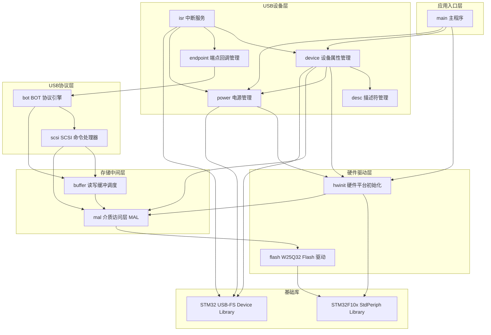

# STM32F103C8T6 + W25Q32 USB MSD 项目框架设计

## 文档信息

| 项目 | 内容 |
|---|---|
| 项目名称 | stm32-w25q32-msd |
| 文档类型 | 框架设计 |
| 版本 | V1.0 |
| 日期 | 2026-06-09 |

---

## 1. 项目概述

**目标**：基于 STM32F103C8T6 + W25Q32 (SPI Flash, 4MB)，实现 USB Full-Speed 大容量存储设备，使 PC 识别为可移动磁盘。

**硬件**：

| 资源 | 型号/规格 |
|---|---|
| MCU | STM32F103C8T6 (Cortex-M3, 72MHz, 64K Flash, 20K SRAM) |
| Flash | W25Q32 (SPI NOR, 4MB, 4KB 扇区, 256B 页) |
| USB | Full-Speed 12Mbps, DP=PA12, DM=PA11 |
| SPI | SPI1, SCK=PA5, MISO=PA6, MOSI=PA7, CS=PA4 |

**软件环境**：Keil MDK V5 + ARMCC V5.06

---

## 2. 系统分层框架

```
┌──────────────────────────────────────────────┐
│                USB 主机 (PC)                  │
└────────────────────┬─────────────────────────┘
                     │ USB FS (12Mbps)
╔════════════════════╧══════════════════════════╗
║  应用入口层 (Application Entry)               ║
║  ┌──────────────────────────────────────┐    ║
║  │ main. 主程序 — 初始化调度 + 主循环    │    ║
║  └──────────────────────────────────────┘    ║
╠══════════════════════════════════════════════╣
║  USB 设备层 (USB Device Layer)               ║
║  ┌───────────┐ ┌──────────┐ ┌───────────┐  ║
║  │ device.   │ │ desc.    │ │ endpoint. │  ║
║  │ 设备属性  │ │ 描述符   │ │ 端点回调  │  ║
║  │ 管理      │ │ 管理     │ │ 管理      │  ║
║  └───────────┘ └──────────┘ └───────────┘  ║
║  ┌───────────┐ ┌──────────┐                ║
║  │ isr.      │ │ power.   │                ║
║  │ 中断服务  │ │ 电源管理 │                ║
║  └───────────┘ └──────────┘                ║
╠══════════════════════════════════════════════╣
║  USB 协议层 (USB Protocol Layer)             ║
║  ┌──────────────────┐ ┌────────────────┐    ║
║  │ bot.             │ │ scsi.          │    ║
║  │ BOT 协议引擎     │ │ SCSI 命令处理器│    ║
║  └──────────────────┘ └────────────────┘    ║
╠══════════════════════════════════════════════╣
║  存储中间层 (Storage Middleware)             ║
║  ┌──────────────────┐ ┌────────────────┐    ║
║  │ buffer.          │ │ mal.           │    ║
║  │ 读写缓冲调度     │ │ 介质访问层     │    ║
║  └──────────────────┘ └────────────────┘    ║
╠══════════════════════════════════════════════╣
║  硬件驱动层 (Hardware Driver)                ║
║  ┌──────────────────────────────────────┐    ║
║  │ flash. W25Q32 SPI Flash 驱动         │    ║
║  └──────────────────────────────────────┘    ║
║  ┌──────────────────────────────────────┐    ║
║  │ hwinit. 硬件平台初始化               │    ║
║  │ (时钟/GPIO/SPI)                      │    ║
║  └──────────────────────────────────────┘    ║
╠══════════════════════════════════════════════╣
║  基础库 (Foundation Libraries)               ║
║  ┌────────────────┐ ┌──────────────────┐    ║
║  │ STM32 USB-FS   │ │ STM32F10x        │    ║
║  │ Device Library │ │ StdPeriph Library │    ║
║  └────────────────┘ └──────────────────┘    ║
╚══════════════════════════════════════════════╝
```

---

## 3. 组件定义

### 3.1 main — 主程序

| 属性 | 说明 |
|---|---|
| 层级 | 应用入口层 |
| 职责 | 按顺序调用下层初始化函数，等待 USB 配置完成，进入中断驱动的主循环 |

### 3.2 device — 设备属性管理

| 属性 | 说明 |
|---|---|
| 层级 | USB 设备层 |
| 职责 | 提供 USB 核心库所需的设备属性结构（端点表、回调表、标准请求处理器），处理所有 USB 标准请求和类请求 |

### 3.3 desc — 描述符管理

| 属性 | 说明 |
|---|---|
| 层级 | USB 设备层 |
| 职责 | 定义并存储所有 USB 描述符（设备、配置、字符串），供 device 在枚举时返回给主机 |

### 3.4 endpoint — 端点回调管理

| 属性 | 说明 |
|---|---|
| 层级 | USB 设备层 |
| 职责 | 提供 EP1_IN / EP2_OUT 的传输完成回调，将端点事件转发给 bot（BOT 协议引擎） |

**端点分配**：

| 端点 | 方向 | 类型 | 包大小 | 用途 |
|---|---|---|---|---|
| EP0 | IN/OUT | Control | 64B | 枚举 / 标准请求 |
| EP1 | IN | Bulk | 64B | 数据读取 + CSW |
| EP2 | OUT | Bulk | 64B | 数据写入 + CBW |

### 3.5 isr — 中断服务

| 属性 | 说明 |
|---|---|
| 层级 | USB 设备层 |
| 职责 | USB 中断处理（USB_LP_CAN1_RX0_IRQn），解析 ISTR 寄存器事件并分发到对应处理函数 |

### 3.6 power — 电源管理

| 属性 | 说明 |
|---|---|
| 层级 | USB 设备层 |
| 职责 | USB 设备上电/断电/挂起/唤醒状态管理，控制 USB D+ 上拉电阻实现软件重连 |

### 3.7 bot — BOT 协议引擎

| 属性 | 说明 |
|---|---|
| 层级 | USB 协议层 |
| 职责 | 实现 Bulk-Only Transport 协议状态机：接收 CBW、解析命令、驱动数据传输、发送 CSW |

**内部状态机**：

```
BOT_IDLE ──→ BOT_DATA_IN ──→ BOT_DATA_IN_LAST ──→ BOT_CSW_Send ──→ BOT_IDLE
          ──→ BOT_DATA_OUT ──────────────────→ BOT_CSW_Send ──→ BOT_IDLE
          ──→ BOT_ERROR ────────────────────→ BOT_IDLE
```

### 3.8 scsi — SCSI 命令处理器

| 属性 | 说明 |
|---|---|
| 层级 | USB 协议层 |
| 职责 | 实现 SCSI 透明命令集子集（约 13 条命令），处理 PC 发来的磁盘操作请求 |

**支持的命令**：

| 命令 | 码 | 数据流向 |
|---|---|---|
| TEST UNIT READY | 0x00 | 无数据 |
| REQUEST SENSE | 0x03 | IN |
| INQUIRY | 0x12 | IN |
| START STOP UNIT | 0x1B | 无数据 |
| ALLOW MEDIUM REMOVAL | 0x1E | 无数据 |
| MODE SENSE (6/10) | 0x1A/0x5A | IN |
| READ FORMAT CAPACITIES | 0x23 | IN |
| READ CAPACITY (10) | 0x25 | IN |
| **READ (10)** | **0x28** | **IN** |
| **WRITE (10)** | **0x2A** | **OUT** |
| VERIFY (10) | 0x2F | 无数据 |
| FORMAT UNIT | 0x04 | 无数据 |

### 3.9 buffer — 读写缓冲调度

| 属性 | 说明 |
|---|---|
| 层级 | 存储中间层 |
| 职责 | 在 USB 端点（64B 包）与逻辑块（512B 扇区）之间做拆包/组包，管理 512B 数据缓冲区和传输状态 |

### 3.10 mal — 介质访问层 (MAL)

| 属性 | 说明 |
|---|---|
| 层级 | 存储中间层 |
| 职责 | 对上屏蔽底层存储硬件差异，提供统一的 Init / Read / Write / GetStatus 接口 |

> **分阶段实现**：
> - **TR2 阶段**：用 SRAM 数组模拟存储，实现 MAL 全部接口，验证 BOT/SCSI/缓冲调度全链路。容量受限（如 8KB），断电数据丢失。
> - **TR3 阶段**：替换为 W25Q32 Flash 驱动(flash)，实现完整 4MB 非易失存储。

### 3.11 flash — W25Q32 SPI Flash 驱动

| 属性 | 说明 |
|---|---|
| 层级 | 硬件驱动层 |
| 职责 | 封装 W25Q32 全部 SPI 操作：初始化验证、页编程、扇区/块/全片擦除、忙状态轮询 |

**硬件连接 (SPI1)**：PA4=CS, PA5=SCK (18MHz), PA6=MISO, PA7=MOSI

### 3.12 hwinit — 硬件平台初始化

| 属性 | 说明 |
|---|---|
| 层级 | 硬件驱动层 |
| 职责 | 初始化系统时钟、GPIO（USB/SPI）、SPI 外设、USB 时钟、NVIC 中断，汇总所有底层初始化 |

---

## 4. 组件依赖关系图



---

## 5. 数据流路径

### 5.1 读取路径 (READ10)

```
PC → EP2 OUT (CBW) → isr → endpoint → bot [CBW_Decode]
                                      → scsi [SCSI_Read10_Cmd]
                                            → buffer [Read_Memory]
                                                ↻ 循环每 512B:
                                                  mal [MAL_Read] → flash [Flash读]
                                                  EP1 IN ← buffer [64B×8 分片发送]
                                      → bot [发送 CSW via EP1 IN] → PC
```

### 5.2 写入路径 (WRITE10)

```
PC → EP2 OUT (CBW) → isr → endpoint → bot [CBW_Decode]
                                      → scsi [SCSI_Write10_Cmd]
                                            → buffer [Write_Memory]
                                                ↻ 循环收数据:
                                                  EP2 OUT → buffer [累积到 512B]
                                                  mal [MAL_Write] → flash [Flash 擦除+编程]
                                      → bot [发送 CSW via EP1 IN] → PC
```

### 5.3 USB 枚举路径

```
PC → USB RESET → isr → device [MASS_Reset: 初始化 EP0/1/2]
PC → GET_DESCRIPTOR(Device) → device → desc → PC
PC → SET_ADDRESS
PC → GET_DESCRIPTOR(Config) → device → desc → PC
PC → SET_CONFIGURATION → device [bDeviceState = CONFIGURED]
PC → INQUIRY → bot → scsi → PC ["W25Q32 Flash Disk"]
PC → READ_CAPACITY → bot → scsi → mal → PC [8192块 × 512B]
PC → READ10(LBA=0) → ... → PC [MBR]
```

---

## 6. 分阶段实施计划

每个阶段均为**可独立上机验证**的里程碑。

---

### 6.1 TR1 — USB 枚举通过

**目标**：PC 设备管理器能识别到 USB 大容量存储设备，显示设备描述符信息。

**涉及组件**：main, device, desc, endpoint, isr, power, hwinit (USB 部分), USB 基础库

**不涉及组件**：bot, scsi, buffer, mal, flash（本阶段不需实现任何存储逻辑）

```
┌─────────────────────────────────────────────────┐
│                    PC (设备管理器)                │
│   ✅ 出现 "STM32 W25Q32 Flash Disk"             │
│   ⚠️ 无法格式化（缺少 SCSI 处理）                 │
└────────────────────┬────────────────────────────┘
                     │ USB FS
╔════════════════════╧═════════════════════════════╗
║  main 主程序                                      ║
║  device 设备属性  desc 描述符  endpoint 端点回调   ║
║  isr 中断服务  power 电源管理                      ║
║  hwinit 硬件初始化 (USB 时钟/GPIO/NVIC)            ║
║  [USB 基础库]                                     ║
╚═══════════════════════════════════════════════════╝
```

**需要完成的工作**：

| 子任务 | 组件 | 说明 |
|---|---|---|
| USB 描述符 | desc | 设备/配置/字符串描述符，含 W25Q32 产品名 |
| 设备属性 + 标准请求 | device | 移植参考项目的 Device_Property / User_Standard_Requests |
| 端点回调 | endpoint | EP1_IN_Callback / EP2_OUT_Callback（暂时可以为空回调，只要能枚举） |
| 中断服务 | isr | USB 中断 ISR，ISTR 事件分发 |
| 电源管理 | power | PowerOn / PowerOff / 软件重连 |
| 硬件初始化 (USB) | hwinit | USB 48MHz 时钟 / PA11 PA12 / USB_DISCONNECT 引脚 / NVIC |
| 主程序 | main | 调用初始化 → 等待 CONFIGURED → 主循环 |

**验证方式**：
1. 编译烧录，USB 插入 PC
2. Windows 设备管理器 → 出现 "STM32 W25Q32 Flash Disk"（可能带黄色感叹号，属正常）
3. USB 描述符工具（如 USBTreeView）可查看完整的设备/配置/字符串描述符
4. 拔插 USB 可复现软件重连

**预估**：1.5 天

---

### 6.2 TR2 — SRAM 虚拟 U 盘

**目标**：PC 可格式化并读写文件，底层存储使用 MCU 内部 SRAM（断电数据丢失）。

**涉及组件**：TR1 全部 + bot, scsi, buffer, mal(SRAM 实现)

**不涉及组件**：flash, hwinit(SPI 部分)

```
┌─────────────────────────────────────────────────┐
│                    PC (文件资源管理器)            │
│   ✅ 格式化 (FAT/FAT32)                         │
│   ✅ 创建/读取/删除文件                          │
│   ⚠️ 容量受 SRAM 限制 (如 8KB)                  │
│   ⚠️ 断电数据丢失                                │
└────────────────────┬────────────────────────────┘
                     │ USB FS
╔════════════════════╧═════════════════════════════╗
║  [TR1 全部组件]                                  ║
║  bot BOT 协议引擎  scsi SCSI 命令处理器          ║
║  buffer 读写缓冲调度                              ║
║  mal MAL — SRAM 实现:                            ║
║     MAL_Read/Write → memcpy 到 SRAM 数组         ║
║     MAL_GetStatus → 报告容量 (如 8KB)             ║
║     无 flash 参与                                 ║
╚═══════════════════════════════════════════════════╝
```

**mal SRAM 实现要点**：

```
static uint8_t sram_disk[SRAM_DISK_SIZE];  // 例如 8KB
Mass_Block_Size  = 512;
Mass_Block_Count = SRAM_DISK_SIZE / 512;   // 例如 16 块

MAL_Read  → memcpy(buf, &sram_disk[offset], len);
MAL_Write → memcpy(&sram_disk[offset], buf, len);
```

**需要完成的工作**：

| 子任务 | 组件 | 说明 |
|---|---|---|
| BOT 协议引擎 | bot | 移植参考项目，CBW 解码 / CSW 构造 / 状态机 |
| SCSI 命令处理器 | scsi | 移植参考项目，约 13 条命令，INQUIRY 改为 W25Q32 标识 |
| SCSI 静态数据 | — | 移植并修改 Standard_Inquiry 等数据 |
| 读写缓冲调度 | buffer | 移植参考项目，64B↔512B 拆包组包 |
| MAL SRAM 实现 | mal | SRAM 数组版 MAL，MAL_OK 直接返回 |
| 主程序 | main | 更新：初始化时调用 MAL_Config（SRAM 版） |

**验证方式**：
1. 编译烧录，USB 插入 PC
2. PC 弹出"需要格式化"对话框 → 格式化
3. 复制一个小文件到 U 盘 → 成功
4. 从 U 盘读回文件 → 内容正确
5. 拔掉 USB（断电），重新插入 → 数据丢失，需要重新格式化 ✓（符合预期）

**预估**：2 天（BOT+SCSI 移植量大，但参考项目代码可直接复用）

---

### 6.3 TR3 — W25Q32 真实 U 盘

**目标**：完整功能，底层使用 W25Q32 SPI Flash，断电数据保持，4MB 全容量。

**涉及组件**：TR2 全部 + flash, hwinit(SPI 部分)，mal 替换为 W25Q32 实现

```
┌─────────────────────────────────────────────────┐
│                    PC (文件资源管理器)            │
│   ✅ 4MB 可移动磁盘                              │
│   ✅ 格式化/读写/删除                            │
│   ✅ 断电数据保持                                 │
│   ✅ 完整 U 盘体验                                │
└────────────────────┬────────────────────────────┘
                     │ USB FS
╔════════════════════╧═════════════════════════════╗
║  [TR2 全部组件]                                  ║
║  mal MAL — W25Q32 实现:                          ║
║     MAL_Read/Write → flash W25Q32 驱动           ║
║     MAL_GetStatus → 8192 块, 512B/块, 4MB        ║
║  flash W25Q32 SPI Flash 驱动                     ║
║  hwinit SPI 引脚 + SPI 外设初始化                 ║
╚═══════════════════════════════════════════════════╝
```

**需要完成的工作**：

| 子任务 | 组件 | 说明 |
|---|---|---|
| W25Q32 驱动 | flash | SPI 读写 / 页编程 / 扇区擦除 / JEDEC ID 验证 / 忙轮询 |
| SPI 硬件初始化 | hwinit | SPI1 GPIO / 外设配置 (Mode0, 18MHz)，追加到 Set_System() |
| MAL W25Q32 实现 | mal | 替换 SRAM 为 W25Q32 调用，GetStatus 返回 4MB 容量 |
| 主程序 | main | MAL_Config 调用链路无需改动（mal 接口不变） |

> mal 接口已由 TR2 验证稳定，TR3 只需替换 mal 内部实现，不会引入协议层 bug。

**验证方式**：
1. 编译烧录，USB 插入 PC
2. 格式化为 FAT/FAT32 → 成功，容量显示 ~4MB
3. 写入大文件（>8KB）→ 验证 4MB 全空间可用
4. 拔掉 USB → 重新插入 → 文件仍然存在 ✓
5. 连续多次读写，验证 SPI 稳定性
6. JEDEC ID 读取出错时的错误处理

**预估**：1.5 天

---

### 6.4 阶段总览

| 阶段 | 目标 | 新增组件 | 预估 | 可验证内容 |
|---|---|---|---|---|
| TR1 | USB 枚举通过 | main, device, desc, endpoint, isr, power, hwinit(USB) | 1.5d | PC 设备管理器可见设备 |
| TR2 | SRAM 虚拟 U 盘 | bot, scsi, buffer, mal(SRAM) | 2d | PC 可格式化/读写文件 |
| TR3 | W25Q32 真实 U 盘 | flash, hwinit(SPI), mal(Flash) | 1.5d | 断电保持, 4MB 全容量 |
| **合计** | | | **5d** | |

> 每个阶段产出可烧录运行的固件，遇问题可锁定在当阶段新增组件范围内排查。

---

## 7. 关键约束

| 约束 | 说明 |
|---|---|
| Flash 先擦后写 | NOR Flash 编程只能将 1→0，写入前必须确保目标区域已擦除为 0xFF |
| 512B 逻辑块 | USB MSD 以 512B 为逻辑块，上层 buffer 负责与 4KB 物理扇区转换 |
| PMA 缓冲区对齐 | 各端点缓冲地址不可重叠，按 64 字节边界对齐 |
| USB 48MHz 时钟 | 必须 PLLCLK ÷ 1.5 = 48MHz |
| SPI 18MHz | 保守值，W25Q32 支持到 80MHz，后续可按需提速 |

---

*文档结束。*
